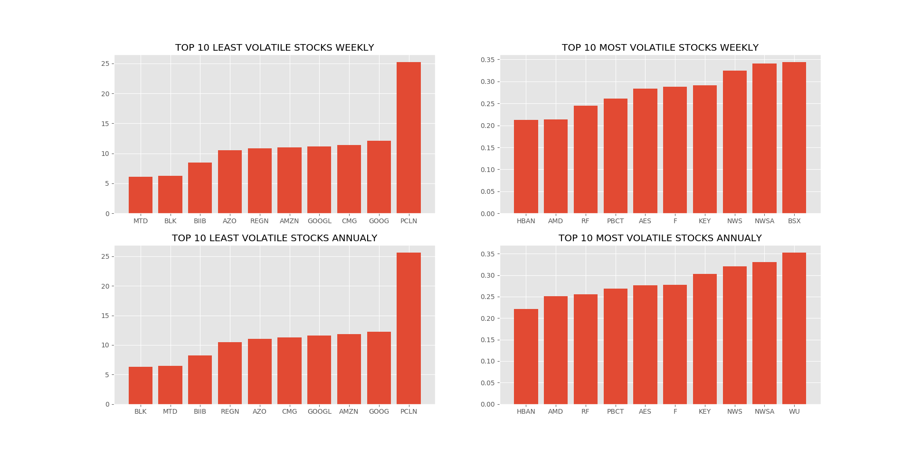
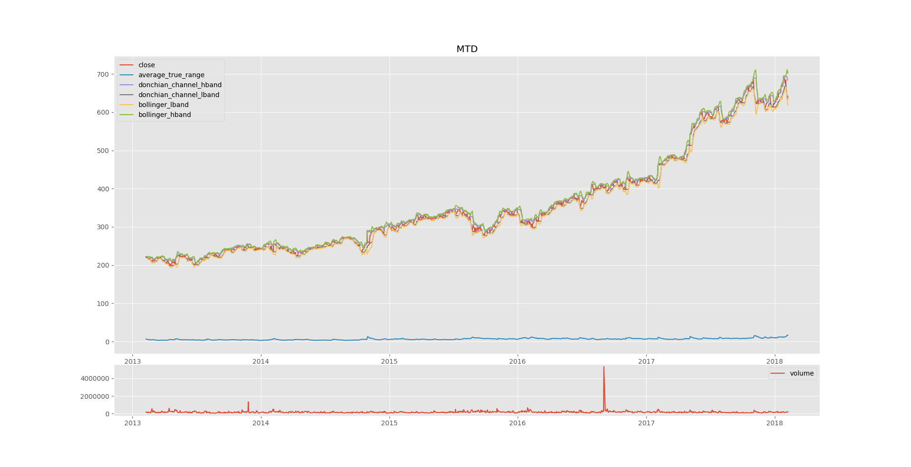
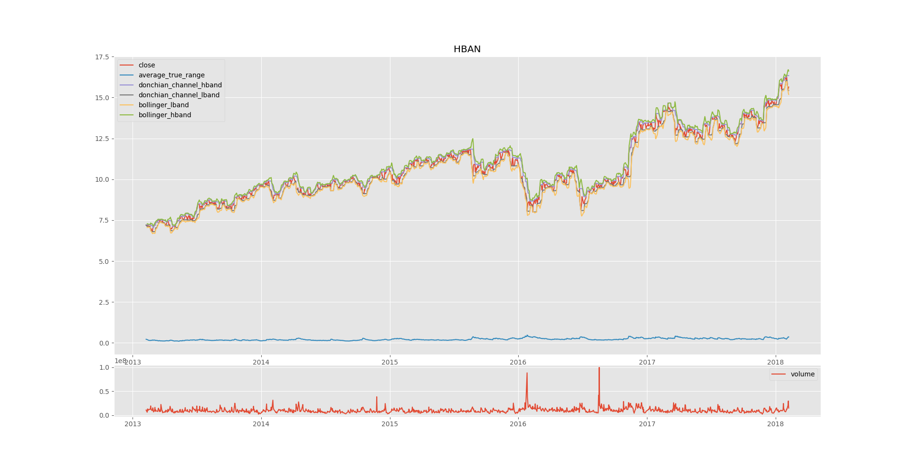

# The operation have been seperated in multiple files
### 1.volatilityIndex
#### run TopTenAndBottomTen.py
	output:
		To 10 volatile and least volatile companies graph will come up
		after closing, detailed graph of most volatile will show and the 
		detailed graph of least volatile will show.
### 2.Pair_trading
#### run corelation.py
	output:
		Heatmap will show up then on the consolse there will a list of top 10 			comapaines (to get the data year wise just pass the year in the index)
### 3.Binary Classification
#### run classify.py
			output:
			on the console screen there will be distribution of the given tocker
			(you can change the ticker from the init) then there will be 				prediction and accuracy by the two classifiers

#### OUTPUT:

